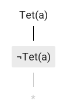

# Ruzsa

[Analytic tableau](https://en.wikipedia.org/wiki/Method_of_analytic_tableaux) editor for [Tarski's World](https://ggweb.gradegrinder.net/support/manual/tarski) \(similar to [Fitch](https://ggweb.gradegrinder.net/support/manual/fitch), but uses the analytic tableau proof method instead of natural deduction\).

Check it out at [https://ruzsa.tbitai.me](https://ruzsa.tbitai.me)!

## Usage

The rules for constructing trees are the same as explained on the [Method of analytic tableaux](https://en.wikipedia.org/wiki/Method_of_analytic_tableaux) Wikipedia page, except that closure is denoted by `*` derived from the lower closing node, like this:



## Development

After cloning the repo, install the dependencies:

```
npm install
```

Build:

```
npm run build
```

Serve the project root directory (not the `dist` directory!) with a static server, e.g. with Python 3:

```
python -m http.server 8000
```

Now the app is available at `http://localhost:8000/dist`.

Serving the project root directory is necessary in order to use the source map files, which point outside of the `dist` directory.

Besides the `build` NPM script, scripts for the individual build steps are available for using during development.

### Deploying

Make a build for deployment:

```
npm run build-for-deploy
```

Deploy to production:

```
npm run deploy
```

Or deploy to staging:

```
npm run deploy-staging
```
