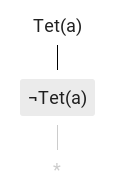

# Ruzsa

[Analytic tableau](https://en.wikipedia.org/wiki/Method_of_analytic_tableaux) editor for [Tarski's World](https://ggweb.gradegrinder.net/support/manual/tarski) \(similar to [Fitch](https://ggweb.gradegrinder.net/support/manual/fitch), but uses the analytic tableau proof method instead of natural deduction\).

Check it out at [https://ruzsa.tbitai.me](https://ruzsa.tbitai.me)!

## Usage

The rules for constructing tableaux are the same as explained on the [Method of analytic tableaux](https://en.wikipedia.org/wiki/Method_of_analytic_tableaux) Wikipedia page, the first-order rules are those contained in the [First-order tableau without unification](https://en.wikipedia.org/wiki/Method_of_analytic_tableaux#First-order_tableau_without_unification) subsection.

Closure is denoted by `*` derived from the lower closing node, like this:

