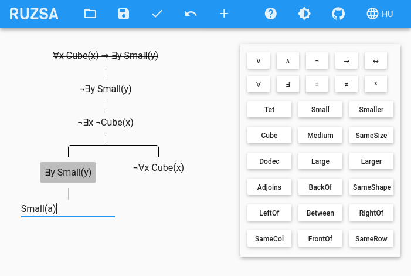

# Ruzsa

Ruzsa (/ˈruʒɒ/) is an educational software for introductory logic courses. It's an 
[analytic tableau](https://en.wikipedia.org/wiki/Method_of_analytic_tableaux) proof editor for 
[Tarski's World](https://www.gradegrinder.net/Support/documentation.html?software=tarski). Thus, Ruzsa is an alternative 
to [Fitch](https://www.gradegrinder.net/Support/documentation.html?software=fitch), but instead of Fitch's natural 
deduction proof method, Ruzsa uses the more beginner-friendly method of analytic tableaux.

Available at <https://ruzsa.tbitai.me>, Ruzsa is free and open-source software.

Ruzsa is used at the [Department of Logic at Eötvös Loránd University](http://phil.elte.hu/logic). It was named after 
[Imre Ruzsa](http://phil.elte.hu/logic/ruzsa.html), the founder of the department.

## Topics

* [How to use Ruzsa](USAGE.md)
* [Release notes](RELEASES.md)
* [Bug reports and feature requests](ISSUES.md)
* [Cookie policy](COOKIES.md)
* [Developer documentation](DEVELOPMENT.md)
