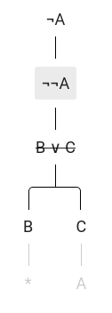

# Release notes

Ruzsa adheres to [Semantic Versioning](http://semver.org/spec/v2.0.0.html).

## 1.2.0: Documentation, convenience improvements (2021-01-16)

New features:

* [Documentation](https://ruzsa.readthedocs.io) on Read the Docs.
* Mobile version.
* Dark theme.
* The virtual keyboard is now collapsible.
* Tooltips in the top toolbar.
* Pressing <kbd>Enter</kbd> is not required anymore for derived sentences.

Bugfixes:

* Fix native fonts causing readability issues: use hosted Roboto and DejaVu Sans.
* Fix focusing next node on node change.
* Fix cursor jumping out of parentheses.
* Fix virtual keyboard input being ignored (most noticeable for `*`).
* Fix subsequent breakdown editability after Undo.
* Fix missing enforcing of syntax check before adding new sentences.

## 1.1.0: Associativity (2018-05-01)

New feature:

* Conjunctions and disjunctions can now be input associatively, and broken down by multiple branching.

## 1.0.3: Possible fix for Check Step temporarily not working (2016-11-27)

Bugfixes:

* Deep object comparison would have reported difference for different property order.
* Some loops through arrays would have run also for non-index properties of the arrays.

Although as far as the author knows there was no part of the system where either of these could happen, these are 
possible causes of the issue that Check Step sometimes reports incorrect step for a correct step but later accepts the 
same step.

## 1.0.2: Fix Check Step after loading from file (2016-11-19)

Bugfix:

* After loading a saved tree from a file, in some cases, Check Step reported incorrect step for correct steps. This was 
  due to not adding back the `WFF` prototype to formulas during loading.

## 1.0.1: Transitivity of equality; strikeout existentially-like quantified formulas (2016-11-19)

Bugfixes:

* Allow inferring according to instances of the transitivity of equality, that is, for example inferring `a = c` from 
  `a = b` and `b = c`.
* Strikeout existentially quantified and negated universally quantified formulas after inferring from them. This won't 
  apply for existing parts of older-version files.
  
## 1.0.0: First-order sentences; strict parsing (2016-11-12)

* Sentences can now be of first-order logic.
* Sentence variables must be between `A` and `Z`, block constants between `a` and `t`, and block variables between `u` 
  and `z`.
* Parentheses are obligatory around subformulas whose main operator is a binary logical connective.

Older-version files will be loaded as read-only.

## 0.4.0: Don't allow mixing breaking-down rules (2016-09-09)

* Don't strike-through formulas broken down as closing.
* Don't allow breaking down mixing rules. E.g. this breaking down was allowed earlier:
  
  

These modifications won't be applied for old parts of older-version files.

## 0.3.1: Backward compatible tracking of broken-down-ness (2016-05-10)

Add missing `brokenDown`s to pre-[v0.2.0](#strike-through-broken-down-formulas-2016-05-09) files. This means that the 
strike-through will work for every file (since the site had no visitor between the deployment of 
[v0.2.0](#strike-through-broken-down-formulas-2016-05-09)+[v0.3.0](#complete-tracking-of-breakability-2016-05-10) and 
[v0.3.1](#backward-compatible-tracking-of-broken-down-ness-2016-05-10) 😄).

## 0.3.0: Complete tracking of breakability (2016-05-10)

`breakable` property of nodes is now set to `false` in all cases when it's appropriate. Truth/falsity of `breakable` 
corresponds to the appearance/non-appearance of the breaking-down menu. This enhancement works for older-version files, 
too.

## 0.2.0: Strike-through broken-down formulas (2016-05-09)

`brokenDown` is added to nodes, denoted by strike-through. This won't work for previously broken-down formulas in 
older-version files.

## 0.1.0: Track Undo possibility (2016-05-02)

`undoStepPossible` is added to the `state`. For older-version files, users won't be able to undo the step that was made 
just before saving.
