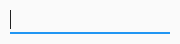
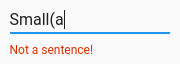
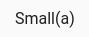
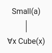
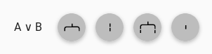
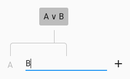
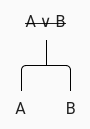
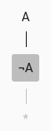

# How to use Ruzsa

## Entering sentences

Enter the first sentence in the input:

Press <kbd>Enter</kbd>, and Ruzsa will check if the sentence is syntactically correct:

Once you enter a correct sentence, it will turn into a node of the tree representing the analytic tableau:

Next, you can add further sentences with the Add button:

On smaller desktops and mobile devices, you can find the Add button in the top toolbar:

New sentences are added as leaves to the tree:

## Breaking down sentences

If you hover your cursor over (or on touchscreen devices, long tap) a sentence, the breakdown menu will appear:

Select the breakdown rule you want to use, and enter the derived sentences:

When you're ready, click on the Check Step button, and Ruzsa will check if your breakdown step is correct.

The complete set of breakdown rules is described in detail on the 
[Method of analytic tableaux](https://en.wikipedia.org/wiki/Method_of_analytic_tableaux) Wikipedia page. The first-order 
rules of Ruzsa are the ones contained in the 
[First-order tableau without unification](https://en.wikipedia.org/wiki/Method_of_analytic_tableaux#First-order_tableau_without_unification) 
subsection. [Closure](https://en.wikipedia.org/wiki/Method_of_analytic_tableaux#Closure) is denoted by `*` derived from 
the lower closing node:

